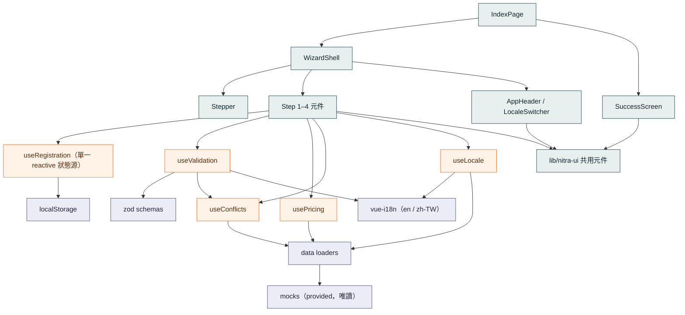

# PLAN.md — 開發歷程

*WebDev Summit 2028* 的活動報名精靈（Vue 3.5.17 + Quasar 2.18.5 + UnoCSS + TypeScript）。
這份文件就是作業要求的開發日誌：我如何規劃、做了哪些決策與原因、加了哪些依賴、如何與 AI 工具
協作、遇到的挑戰，以及若有更多時間會改進什麼。

架構決策完整記錄在 [`doc/`](doc/) 的 ADR，本文沿途引用。

---

## 架構總覽



**分四層，依賴一律由外往內流（畫面 → 邏輯 → 領域/資料），內層不認識外層：**

- **UI 層（綠）** — 頁面與功能元件。`WizardShell` 是外殼（頁首、步驟列、表單區、動作列），渲染四個
  步驟與完成頁；元件只負責**渲染與發事件**，不放業務邏輯。所有共用視覺原語都來自 `lib/nitra-ui`
  函式庫（見 [ADR-0007](doc/0007-shared-ui-library.md)）。
- **Composables 層（橘）— 邏輯只放這裡。** `useRegistration` 是**唯一的真實狀態來源**（一個
  `reactive` store，持久化到 `localStorage`）；`usePricing`／`useConflicts` 是純衍生的 `computed`
  （VIP 折扣、時間重疊與額滿）；`useValidation` 在送出時跑、之後即時重算；`useLocale` 把語言、
  日期格式與 mock 內容翻譯統一收斂在一處。這層全部可單獨測試，不依賴任何元件。
- **Schema／i18n／資料層（紫）** — `zod` schema 定義驗證規則並推導型別；`vue-i18n` 提供雙語字串
  並驅動 zod 訊息；`data loaders` 把 provided 的 `mocks`（唯讀）映射成 domain 型別，之後若要換成
  真 API 只需改這一層。
- **跨切面**：i18n 同時被 UI、`useValidation`、`useLocale` 消費；持久化是 `useRegistration` 唯一的
  副作用（用 `watch`，不是 `computed`）。

兩個刻意分開的概念：**可用性**（額滿、工作坊重疊 → 即時 `computed`、會 disable 控件）與**驗證**
（整張表單在送出時跑一次、之後即時清錯），讓導航永不被擋、同時錯誤能隨修隨清
（見 [ADR-0003](doc/0003-deferred-unified-validation.md)）。

---

## 1. 如何規劃與拆解任務

先讀完作業文件與 repo `README.md`，再把工作切成 **基礎建設 → 垂直切片 → 設計還原 → 收尾打磨**，
讓每一步都能獨立 demo：

1. **基礎建設** — 先把工具與契約立好再寫功能：ESLint 設定、husky pre-push lint 守門、`CLAUDE.md`
   專案契約，以及一個 `doc/` ADR 資料夾，把我預期會有爭議的決策（狀態管理、驗證策略）先寫下來。
   共用原語（字體、排版、卡片、輸入框）先做，後面 step 才有得組。
2. **四個步驟，逐一垂直切片** — 與會者 → 場次 → 加購 → 確認，每一步都讀寫同一個共用 store，
   外加完成頁。
3. **業務邏輯放在純的、可測的 composable** — `usePricing`（VIP 折扣）、`useConflicts`
   （時間重疊／額滿）、`useValidation`（送出時驗證），都抽離元件。
4. **設計還原** — 從 Figma 拉**精確數值**（不靠肉眼）並用截圖迴圈逐頁比對。
5. **打磨與 nice-to-have** — RWD、i18n（英文 + 繁中），以及把共用 UI 抽成 `lib/nitra-ui` 函式庫。

較大的工作我用 GitHub issues/epics 追蹤，commit 保持 **atomic 且 Conventional Commits 格式**，
因為作業把 commit history 當成程式碼品質的評分訊號。

## 2. 關鍵決策與原因

以下為摘要，完整論證見各 ADR：

- **狀態：單一 `reactive()` composable，不用 Pinia**（[ADR-0001](doc/0001-state-management-composable.md)）。
  整個精靈就一個跨步驟物件；用 module-level `reactive` store 包在 `useRegistration()` 後面，是
  滿足「跨步驟保留資料」、持久化到 `localStorage`、又保持可測的**最小**做法。為了一個 store 引入
  Pinia 是多餘的依賴與儀式。
- **驗證：zod，延後到送出**（[ADR-0002](doc/0002-validation-with-zod.md)、
  [ADR-0003](doc/0003-deferred-unified-validation.md)）。作業明確要求導航永不被擋、驗證在送出時
  統一進行。我把**可用性**（額滿、工作坊重疊是即時 `computed` 並 disable 控件）與**驗證**
  （送出時跑一次 `validateAll()`）分開。第一次送出後，錯誤改成**即時**重算——使用者一修正、提示
  立刻消失，不需要再送一次。
- **重疊場次：紅框 + 提示，而非 disable。** Figma 畫成 disable，但 spec 規定場次可自由選、衝突在
  送出時呈現（只有**工作坊**重疊才 disable）。我照 spec 做，並把這個與設計稿的分歧記在 ADR-0003。
  詳見 §5。
- **字體一律走 `<Text>` 元件**、用 style-guide variant、不寫死 `px`，讓字級一致且 tokenized。
- **TypeScript 搭 JSDoc 記錄意圖**（[ADR-0006](doc/0006-typescript-with-jsdoc.md)）；
  **ESLint 而非 oxlint**（[ADR-0004](doc/0004-eslint-over-oxlint.md)）；
  **pre-push lint 守門**（[ADR-0005](doc/0005-pre-push-lint-hook.md)）。
- **共用 UI 函式庫 `lib/nitra-ui`**（[ADR-0007](doc/0007-shared-ui-library.md)）。專案後期，把
  app-agnostic 的原語從 `src/components` 抽到一個 flat、無 barrel 的函式庫，用 `@lib` alias 引入，
  新增 `Button`，並讓 `OptionGroup` 成為日期 toggle、分類 tabs、語言切換器共用的單一 segmented
  control。

## 3. 我加的依賴（與替代方案）

starter 已預裝 Vue、Quasar、UnoCSS。我只加了兩個 runtime 依賴：

- **`zod`** — schema 驗證。*要解決：* 送出時做一次統一、宣告式、能推導型別、錯誤訊息良好的驗證。
  *替代方案：* `yup`（較重、TS 推導較弱）、`valibot`（更輕但較不熟）、或純手刻（程式碼多、沒有
  推導型別）。zod 免費給 `z.infer` 型別、能把各步驟 schema 組成一個，並用 `superRefine` 支援
  「選了周邊商品才需要寄送地址」這種條件式規則。
- **`vue-i18n`**（v11）— 用於 *nice-to-have* 的國際化。*要解決：* 英文 + 繁體中文，並可即時切換。
  *替代方案：* 自己用字典手刻 `t()`（對純文字夠用，但我還要插值、未來可擴充複數、以及把 zod 訊息
  也本地化）、或 `@intlify` 較低階 API。vue-i18n 是 Vue 生態的事實標準，用 Quasar boot file 接得很乾淨。

僅開發用：ESLint + `eslint-plugin-vue` + `typescript-eslint`、husky。日期／數字格式用平台 `Intl`
API（無額外依賴）。

## 4. 我如何使用 AI 工具

我以 **Claude Code**（Claude Opus）為主要協作對象，主要在終端機操作，並接上 **Figma MCP** 與
**Playwright**。這是經過審查的協作，不是盲目接受。最有用的模式、以及 AI 失手的地方如下：

**有效的部分**

- **用精確設計數值取代肉眼比對。** 早期還原時 AI 靠「看截圖」對齊，padding、字重、邊框色都會錯一點。
  解法是停止肉眼比對，改用 MCP（`get_design_context` / `get_variable_defs`）從 Figma 拉**精確值**
  ——真實 hex、尺寸、以及 React/Tailwind 參考碼——再翻譯成我們的 UnoCSS 語意 token。還原度立刻
  到位。*有效的 prompt：* 「用 get_design_context 跟 get_variable_defs 抓 node X 的精確 spec，
  不要看截圖猜。」
- **會自我檢查的視覺迴圈。** 我讓 AI 用 Playwright 驅動執行中的 app、在桌機與手機寬度各截圖每個
  步驟，再跟 Figma frame 比對——讓「看起來做好了」變成「這是截圖 vs 設計稿」。這抓到不少肉眼會漏的
  regression。
- **每個 PR 都跑 AI code review 的 GitHub Action**，而且它**真的抓到我自己改動裡的 bug**——例如
  review workflow 每次 push 都新增留言（洗版）、某個 `Stepper` 違反自家 ADR 把函式庫耦合到
  `vue-i18n`、語言切換器有個未防守的型別轉換。我逐一修掉再重跑 review——真正的「AI 審 AI、人類
  仲裁」迴圈。
- **ADR 與這份日誌**都用 AI 起草、再人工校正求準——產出快，校過就誠實。

**AI 失手之處（以及我如何修正）**

- **它不知道的工具細節。** UnoCSS 的 `border-[var(--x)]` 會被當成 `border` 簡寫而悄悄重設寬度/樣式
  （選取卡片少了 2px 邊框）；Quasar 的 `.flex` 強制 `flex-wrap: wrap`（segmented control 在手機
  換行）；Quasar 的 `.hidden` 帶 `!important`（所以 `md:block` 蓋不過）。AI 產出看似合理卻細微錯誤
  的程式碼；我靠在瀏覽器檢查 computed style 逐一診斷並釘住修法
  （`border-[color:var(...)] border-solid`、`flex-nowrap`、`max-md:hidden`）。
- **review workflow「通過」卻什麼都沒貼。** 這花了好幾輪。根因是 `CLAUDE_CODE_OAUTH_TOKEN` 過期
  （action 第一個 turn 就 error——`is_error: true`、`num_turns: 1`——但 job 仍回 exit 0）。第二個是
  AI 引入的 regression：對 agent 的 `Write` 工具做路徑限制（`Write(review-output.md)`）這個 action
  **不支援**、會把**所有**寫入 deny 掉。我得到的教訓：別相信綠勾，要驗證實際產物，並把確定性步驟
  （貼留言）交給 **workflow** 而非交給 model 臨場發揮。
- **講太滿。** 有一刻 AI 跟我說單元測試是必要的，依據卻是我們自家 `CLAUDE.md` 的「definition of
  done」，而非作業真正的規格（規格把測試覆蓋率列在 *Not Evaluated*）。我靠重讀 spec 抓到。直白地
  說：AI 的輸出跟其他東西一樣，都需要「來源在哪？」的檢視。

總結：AI 大幅加速了「無聊的」與「廣度的」工作（鷹架、token 翻譯、重複的 i18n 抽字串、截圖 QA），
但每個非平凡的決策、每句「它能動了」我都驗證過——每次有意義的改動都跑
`yarn lint && yarn typecheck && yarn build` 加一張截圖。

## 5. 挑戰與解法

- **設計還原** — 靠把肉眼比對換成 Figma MCP 精確值 + Playwright 截圖對照迴圈解決（§4）。
- **驗證體驗** — 「自由導航 + 送出時統一驗證」與「錯誤隨修隨清」看似衝突。解法是把可用性
  （即時 `computed`）與驗證（送出時）分開，再把錯誤狀態做成只在第一次送出後才出現、之後即時重算的
  `computed`，且永不擋導航（[ADR-0003](doc/0003-deferred-unified-validation.md)）。
- **spec 與 Figma 對重疊場次的分歧** — 設計稿 disable、spec 保留可選且送出才提示衝突。我照 spec，
  把衝突呈現為紅框 + 行內提示（外加步驟 badge 與確認頁橫幅），並記錄分歧讓下個讀者不意外。
- **i18n 翻 provided mock 資料** — `src/mocks/**` 是不可改的 provided 檔，票券／場次／加購文案不能
  跟翻譯放一起。我把它們的文字鏡射到 id-keyed 的 `content.{en,zh-TW}.ts`，用 `useLocale()`
  composable 以 id 解析，日期用 `Intl` 依語言格式化，並把 zod 訊息改成 i18n key 於顯示時翻譯——
  切語言時連驗證提示都跟著翻。
- **工具鏈撞雷** — 見 §4 的 UnoCSS／Quasar 細節。
- **可信賴的 AI review pipeline** — 重新架構成：workflow step 抓 diff、agent 只把 review *寫* 進
  檔案、最後一步**一定**把它貼出來（sticky、就地更新），且 review 內文用繁體中文。

## 6. 若有更多時間會改進什麼

- **單元測試。** 測試覆蓋率明確**不評分**，所以我優先做功能——但純邏輯
  （`isOverlapping`、`usePricing`、`useConflicts`、`validateAll`）正是我會用 Vitest 優先覆蓋的部分，
  以求 regression 安全。
- **無障礙深度** — 為 segmented `OptionGroup` 加方向鍵 roving focus（ARIA radio 模式），以及步驟
  轉場時更完整的 focus 管理。
- **`q-icon` 收斂** — app 元件裡還有少數直接用 `q-icon` 的地方，可全部改走 `lib/nitra-ui` 的 `Icon`
  包裝以求一致（函式庫內部已經改用了）。
- **動畫打磨** — 更豐富的步驟轉場與選取時的微互動。
- **真正的送出** — 把 mock 送出換成 API 呼叫，加上 loading／error 狀態與 optimistic UI。

---

### 如何執行

```bash
yarn          # Node 22.17.0
yarn dev      # http://localhost:9001
yarn lint && yarn typecheck && yarn build   # 全綠
```
